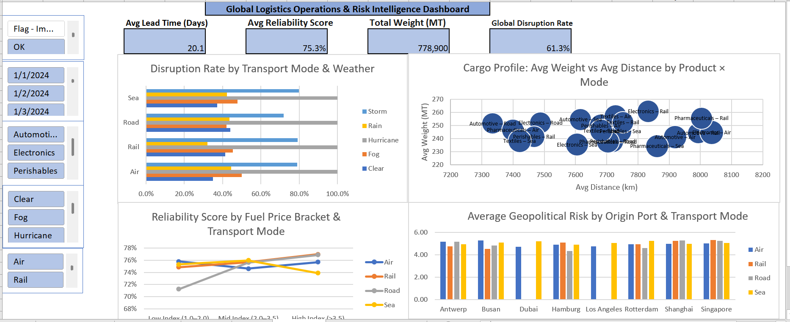

# Enterprise Supply Chain Risk & Operational Logistics Cockpit

An Excel + Power Query + DAX cockpit built on 5,000 shipment records, designed
to surface weather, geopolitical, fuel-price, and data-quality risk across four
transport modes.

(images/engineering_notes(1).png)(images/engineering_notes(2).png)(images/engineering_notes(3).png)

## Overview

- **Data source:** 5,000 shipment-level transactions across 8 ports and 4 transport modes
- **Tools:** Excel, Power Query (M), DAX, Excel Data Model
- **Target audience:** COO / VP Supply Chain / Logistics Directors
- **Core output:** single-screen dashboard with KPIs, four diagnostic charts,
  and five slicers

## Repo structure

├── data/ Raw CSV (5,000 rows)
├── excel/ The workbook
├── images/ Dashboard and pivot screenshots
├── power_query/ M code for both queries
├── dax/ DAX measure definitions
└── docs/ Data dictionary and methodology

## Key findings

1. **Weather** — Hurricane exposure is categorical (100% disruption across all
   modes). On the clean subset, Road is the most storm-resilient mode (71.9%
   disruption vs 79–80% for Air, Rail, Sea).
2. **Fuel price** — The apparent full-dataset Rail sensitivity (77.5% → 74.9%
   across Low → High fuel index) reverses after removing implausible records
   (74.9% → 77.0%). Original finding withdrawn.
3. **Cargo profile** — On the clean subset, Automotive carries the heaviest
   average shipment weight (247.2 MT). Bubble chart on the dashboard plots
   weight vs distance per product × mode.
4. **Data quality** — 1,828 records (36.6%) assign Rail or Road to cross-
   continent routes. Surfaced as a slicer, not silently corrected. This is the
   headline finding of the project.

## Reproduce

1. Open `excel/Global_Logistics_Risk_Dashboard.xlsx`
2. **Data → Refresh All**
3. Use the **Data Confidence** slicer to toggle between the full dataset and
   the plausible-only subset

## Limitations

See `docs/methodology.md` and the `Engineering & Insights` sheet. Key caveats:
no cost field (disruption rate is unweighted), no Carrier_ID (reliability is
route-level), no causal inference on fuel-price findings.

## License

MIT — see `LICENSE`