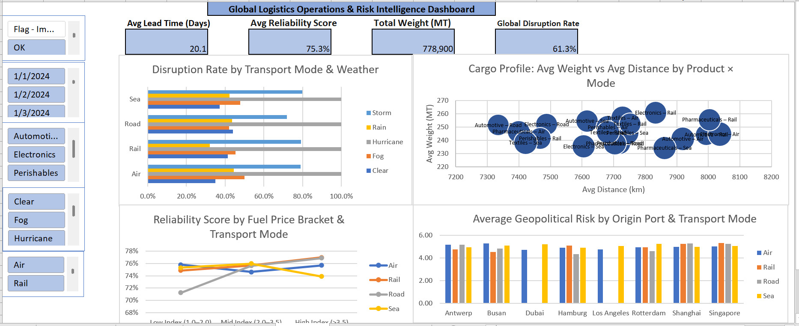

# Enterprise Supply Chain Risk & Operational Logistics Cockpit

**An Excel-based supply chain risk analytics cockpit designed to identify operational, environmental, geopolitical, fuel-price, and data-quality risks across 5,000 shipment records and four transport modes.**


---

## 📌 Business Objective

The objective of this project was to build an operational supply-chain risk cockpit that enables logistics decision-makers to identify and investigate disruption patterns across:

- Transport modes
- Weather conditions
- Geopolitical risk
- Fuel-price conditions
- Shipment characteristics
- Route-level exposure
- Data-quality issues

### Primary Business Questions

- Which transport modes show different disruption patterns under adverse conditions?
- How does disruption vary across weather and fuel-price conditions?
- Which shipment/product profiles carry the greatest operational exposure?
- Where are potential data-quality issues affecting operational interpretation?
- Can management distinguish between observed risk patterns and conclusions that require further investigation?

### Target Audience

- Chief Operating Officers (COOs)
- VP / Directors of Supply Chain
- Logistics Directors
- Operations Managers
- Supply Chain Analysts

---

## 📊 Dashboard Preview



The final deliverable is a **single-screen operational dashboard** containing:

- Key supply-chain risk KPIs
- Transport-mode analysis
- Weather-risk analysis
- Fuel-price analysis
- Cargo-profile analysis
- Route-level risk information
- Data-confidence analysis
- Interactive slicers for filtering the underlying shipment population

---

## 🗂️ Dataset

The project uses **5,000 shipment-level records** covering:

- 8 ports
- 4 transport modes
- Multiple shipment/product profiles
- Weather conditions
- Fuel-price conditions
- Geopolitical risk indicators
- Route information
- Shipment weight and distance
- Disruption outcomes

The dataset was structured to support both operational risk analysis and data-quality investigation.

---

## 🛠️ Tools & Skills Demonstrated

| Area | Tools / Techniques |
|---|---|
| Data Preparation | Microsoft Excel, Power Query |
| Transformation | Power Query M |
| Data Modeling | Excel Data Model |
| Analysis | PivotTables, PivotCharts |
| Calculations | DAX |
| Risk Analysis | Disruption-rate analysis, segmentation, scenario comparison |
| Data Quality | Plausibility checks, data-confidence classification |
| Visualization | KPI cards, charts, slicers |
| Documentation | Data dictionary, methodology documentation |
| Business Communication | Findings, limitations, management recommendations |

---

## 🔄 Analytical Workflow

The project followed an end-to-end analytical workflow:

```text
Raw Shipment Data
        ↓
Data Quality & Plausibility Checks
        ↓
Power Query Transformation
        ↓
Data Confidence Classification
        ↓
Excel Data Model
        ↓
DAX Measures & Pivot Analysis
        ↓
Risk & Operational Analysis
        ↓
Interactive Dashboard
        ↓
Findings & Recommendations
```

A key principle of the project was to **separate observed patterns from conclusions that depend on questionable records or incomplete business information**.

---

## 🔎 Key Findings

### 1. Data quality is a significant operational consideration

**1,828 records (36.6% of the dataset)** assign Rail or Road to routes spanning different continents.

Rather than silently correcting these records, they were retained and surfaced through a **Data Confidence** classification and slicer.

This allows users to compare results across the full dataset and the plausible-only subset while preserving transparency about the underlying data.

### 2. Weather exposure differs by transport mode

Hurricane exposure is categorical in the dataset, with **100% disruption recorded across all transport modes** under the hurricane condition.

After restricting the analysis to the plausible-only subset:

- Road: **71.9% disruption**
- Air: approximately **79–80%**
- Rail: approximately **79–80%**
- Sea: approximately **79–80%**

Road therefore shows the lowest observed disruption rate within the clean subset for this specific scenario.

### 3. Fuel-price interpretation changed after data-quality filtering

The initial full-dataset analysis appeared to show Rail disruption decreasing as the fuel index moved from Low to High:

**77.5% → 74.9%**

However, after removing implausible records, the relationship reversed:

**74.9% → 77.0%**

The original interpretation was therefore **withdrawn** rather than presented as a definitive finding.

This illustrates why data-quality validation is important before interpreting operational relationships.

### 4. Cargo profile varies by product

Within the plausible-only subset, **Automotive** had the highest average shipment weight at approximately **247.2 MT**.

The dashboard's bubble chart compares shipment weight and distance across product and transport-mode combinations to help identify different operational profiles.

### 5. Risk patterns should be interpreted alongside data confidence

Several apparent relationships in the full dataset change after implausible records are excluded.

The dashboard therefore provides a **Data Confidence** slicer that allows decision-makers to compare:

- Full dataset
- Plausible-only subset

This prevents potentially unreliable records from being hidden while making their effect on the analysis visible.

---

## 💡 Business Recommendations

Based on the analysis and its limitations, the following actions are recommended:

1. **Prioritize data-quality remediation** for the 1,828 cross-continent Rail/Road route records before using the dataset for operational planning or automated risk scoring.

2. **Use the Data Confidence classification when reviewing risk metrics**, particularly where conclusions differ substantially between the full and plausible-only populations.

3. **Investigate the underlying causes of cross-continent Rail/Road assignments** with the relevant data owners rather than applying assumptions to correct the records automatically.

4. **Use transport-mode comparisons as diagnostic evidence rather than causal conclusions**, particularly for weather and fuel-price relationships.

5. **Further investigate high-weight shipment profiles**, including Automotive, to understand whether cargo weight is associated with different route, mode, or disruption exposures.

6. **Improve the underlying data model** by incorporating cost and carrier-level information in future versions, enabling weighted disruption analysis and carrier reliability assessment.

---

## ⚠️ Data Quality & Analytical Considerations

Data quality was treated as an analytical component of the project rather than a preprocessing task hidden from the final dashboard.

### Key Issue

A substantial portion of the dataset contains route/mode combinations that require business validation.

Instead of deleting these records:

- The records were retained.
- Their confidence was classified.
- The dashboard exposes the classification.
- Results can be compared between the complete dataset and the plausible-only subset.

This approach preserves transparency and allows stakeholders to see how data quality affects the resulting analysis.

---

## 📁 Repository Structure

```text
supply-chain-risk-cockpit/
├── data/
│   └── Raw shipment data (5,000 records)
│
├── dax/
│   └── DAX measure definitions
│
├── docs/
│   ├── Data dictionary
│   └── Methodology documentation
│
├── excel/
│   └── Global_Logistics_Risk_Dashboard.xlsx
│
├── images/
│   └── Dashboard and supporting analysis screenshots
│
├── power query/
│   └── Power Query M code
│
├── .gitattributes
├── .gitignore
├── LICENSE
└── README.md
```

### Key Repository Components

| Component | Purpose |
|---|---|
| `data/` | Source shipment data |
| `power query/` | Power Query M transformation logic |
| `dax/` | DAX measure definitions |
| `excel/` | Complete analytical workbook |
| `images/` | Dashboard and supporting visualizations |
| `docs/` | Data dictionary and methodology |
| `README.md` | Project documentation |

---

## 🚀 How to Reproduce the Analysis

1. Download `excel/Global_Logistics_Risk_Dashboard.xlsx`.

2. Open the workbook in **Microsoft Excel**.

3. Select **Data → Refresh All** to refresh the Power Query pipeline and connected analysis.

4. Open the dashboard.

5. Use the **Data Confidence** slicer to compare:
   - Full dataset
   - Plausible-only subset

6. Explore the remaining slicers and dashboard visuals to investigate risk patterns by transport mode, weather, fuel conditions, product, and other available dimensions.

---

## 📋 Limitations

The analysis should be interpreted within the limitations of the available dataset.

### No Cost Field

The dashboard focuses primarily on disruption rates. Without shipment-level cost information, disruption is not weighted by financial impact.

A future version could incorporate shipment value, transportation cost, or estimated disruption cost.

### No Carrier_ID

The dataset does not contain a carrier identifier. Consequently, carrier reliability cannot be assessed at the individual carrier level.

The current analysis focuses on route- and transport-mode-level patterns instead.

### Data Quality

The 1,828 cross-continent Rail/Road records represent a substantial data-quality concern and may influence some full-dataset results.

### No Causal Inference

Observed relationships between fuel prices, weather conditions, transport modes, and disruption rates should not be interpreted as causal effects.

The analysis identifies patterns for further investigation rather than establishing causality.

### Synthetic / Simulated Data Considerations

The project is designed as a portfolio analytics exercise using structured shipment records. Findings should therefore be interpreted as analytical demonstrations rather than claims about a specific real-world logistics network.

---

## 🎯 Skills Demonstrated

This project demonstrates practical experience with:

- Excel analytics
- Power Query
- Power Query M
- DAX
- Excel Data Model
- Data-quality investigation
- Operational risk analysis
- Supply-chain analytics
- Scenario analysis
- Data-confidence classification
- Pivot-based analysis
- Interactive dashboard development
- Business insight generation
- Analytical documentation
- Evidence-based recommendations

---

## 📌 Project Status

**Complete**

The repository contains the analytical workbook, Power Query transformation logic, DAX measures, supporting documentation, source data, and dashboard visuals required to understand and reproduce the analysis.

---

## 📄 License

This project is licensed under the **MIT License**. See [`LICENSE`](LICENSE) for details.
